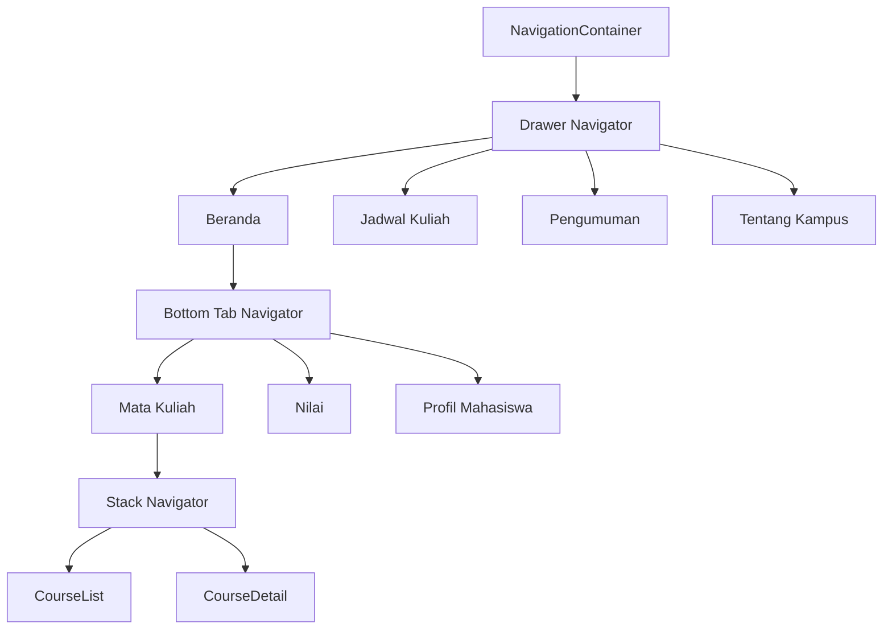

# Arsitektur Aplikasi E-Kampus Mini

## 1. Tujuan

Dokumen ini menjelaskan arsitektur navigasi, struktur layar, sumber data, dan keputusan desain pada aplikasi E-Kampus Mini berbasis Expo.

## 2. Navigator Hierarchy

## 3. Lapisan Navigasi

### Layer 1: Drawer Navigator

Tanggung jawab:

- entry point utama aplikasi
- menyediakan menu global
- menampung screen yang tidak selalu berada dalam konteks tab

Screen:

- `Beranda`
- `JadwalKuliah`
- `Pengumuman`
- `TentangKampus`

### Layer 2: Bottom Tab Navigator

Tanggung jawab:

- mengelompokkan fitur inti akademik di area Beranda
- memberi akses cepat ke fitur yang paling sering dipakai

Tab:

- `MataKuliah`
- `Nilai`
- `ProfilMahasiswa`

### Layer 3: Stack Navigator

Tanggung jawab:

- menangani transisi hierarkis daftar ke detail
- menjaga pola navigasi drill-down tetap natural

Screen:

- `CourseList`
- `CourseDetail`

## 4. Data Model Sederhana

Karena fokus tugas adalah navigasi, data diletakkan sebagai konstanta lokal:

### `STUDENT`

Menyimpan identitas mahasiswa:

- nama
- NIM
- prodi
- fakultas
- semester
- email
- nomor HP
- alamat
- status
- IPK
- SKS lulus

### `COURSES`

Array objek mata kuliah berisi:

- `id`
- `name`
- `code`
- `credits`
- `lecturer`
- `schedule`
- `room`
- `description`
- `icon`
- `accent`
- `grade`

### `WEEKLY_SCHEDULE`

Array dua dimensi untuk jadwal mingguan berdasarkan hari.

## 5. Bonus Feature Mapping

### `useNavigation()`

Lokasi:

- `QuickNavigateCard`

Alasan:

- komponen reusable ini tidak menerima prop `navigation`
- tetap perlu memicu perpindahan ke `CourseDetail`

### `navigation.setOptions()`

Lokasi:

- `CourseDetailScreen`

Alasan:

- judul header harus berubah sesuai mata kuliah yang dipilih

### `tabBarBadge`

Lokasi:

- tab `Nilai`

Alasan:

- menunjukkan ada item notifikasi akademik yang belum dilihat

## 6. Keputusan Desain

Referensi visual `stitch` mengarahkan implementasi pada:

- warna primer navy
- aksen gold
- tonal surfaces
- hero section editorial
- bottom navigation membulat
- drawer profile block

Adaptasi ke React Native dilakukan melalui:

- `StyleSheet`
- `ScrollView`
- `Pressable`
- ikon `Ionicons` dan `MaterialCommunityIcons`

## 7. Alur Pengguna

### Alur Mata Kuliah

1. Pengguna membuka `Beranda`
2. Tab default mengarah ke `Mata Kuliah`
3. Pengguna melihat daftar MK
4. Pengguna menekan kartu MK
5. Aplikasi berpindah ke `CourseDetail`
6. Header berubah mengikuti nama MK

### Alur Bonus Hook

1. Pengguna menekan `QuickNavigateCard`
2. Komponen memanggil `useNavigation()`
3. Aplikasi membuka `CourseDetail` tanpa perlu `navigation` prop

### Alur Jadwal

1. Pengguna membuka drawer
2. Memilih `Jadwal Kuliah`
3. Aplikasi menampilkan tabel mingguan per hari

## 8. Keunggulan Struktur Ini

- mudah dibaca karena peran setiap navigator jelas
- scalable untuk penambahan fitur baru
- sesuai pola UX umum aplikasi mobile
- memenuhi spesifikasi praktikum secara langsung

## 9. Potensi Pengembangan Lanjutan

- memecah screen ke folder terpisah
- menambah TypeScript types khusus untuk setiap navigator
- memindahkan data ke API atau local storage
- menambah login flow dan auth stack
- menambahkan global state untuk user session
