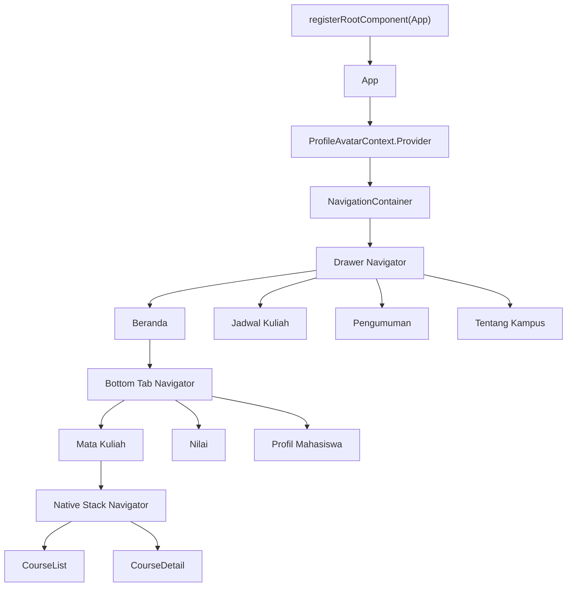

# Arsitektur Aplikasi E-Kampus Mini

## 1. Tujuan Dokumen

Dokumen ini menjelaskan arsitektur teknis aplikasi E-Kampus Mini berdasarkan kode yang ada pada proyek saat ini. Fokus utama dokumen mencakup lapisan bootstrap, konfigurasi, navigasi, state, data, komponen bersama, serta perubahan implementasi yang relevan untuk Expo SDK 55.

## 2. Ringkasan Arsitektur

Arsitektur aplikasi dibangun di atas empat lapisan utama:

1. lapisan bootstrap dan konfigurasi proyek
2. lapisan navigasi bertingkat
3. lapisan data dan state UI
4. lapisan presentasi dan komponen bersama

Struktur navigasi utama tetap:

- `Drawer Navigator` sebagai navigasi global
- `Bottom Tab Navigator` sebagai area fitur utama
- `Native Stack Navigator` sebagai alur detail mata kuliah

## 3. Lapisan Bootstrap dan Konfigurasi

### 3.1 Entry Point

File [index.ts](../index.ts) menjalankan `registerRootComponent(App)`. Dengan demikian, `App.tsx` menjadi root component baik saat proyek dijalankan di Expo Go maupun pada native build.

### 3.2 Konfigurasi Expo

File [app.json](../app.json) menunjukkan konfigurasi berikut:

- nama dan slug aplikasi: `e-kampus-mini`
- orientasi: `portrait`
- tampilan: `light`
- Android: `predictiveBackGestureEnabled: false`
- plugin aktif: `expo-font`

Konfigurasi ini konsisten dengan implementasi UI yang berorientasi portrait dan menggunakan ikon berbasis font dari `@expo/vector-icons`.

### 3.3 Konfigurasi Babel

File [babel.config.js](../babel.config.js) menggunakan:

- `babel-preset-expo`
- `react-native-reanimated/plugin`

Plugin Reanimated wajib ada agar dependency navigasi yang menggunakan Reanimated dapat berjalan benar pada Expo SDK 55.

### 3.4 Konfigurasi TypeScript

File [tsconfig.json](../tsconfig.json) menggunakan:

- `extends: expo/tsconfig.base`
- `strict: true`
- `exclude: ["dist", "node_modules"]`

Pendekatan ini menjaga konsistensi tipe tanpa memasukkan folder build hasil ekspor ke dalam pemeriksaan TypeScript.

## 4. Peta Dependency yang Dipakai

Dependency inti berdasarkan [package.json](../package.json):

- `expo`
- `expo-status-bar`
- `expo-font`
- `expo-image-picker`
- `react`
- `react-native`
- `react-dom`
- `react-native-web`
- `@expo/vector-icons`
- `@react-navigation/native`
- `@react-navigation/drawer`
- `@react-navigation/bottom-tabs`
- `@react-navigation/native-stack`
- `react-native-gesture-handler`
- `react-native-reanimated`
- `react-native-worklets`
- `react-native-safe-area-context`
- `react-native-screens`

Keputusan arsitektural penting:

- `@react-navigation/stack` tidak lagi digunakan
- `@react-navigation/native-stack` dipilih untuk mengurangi kompleksitas dan menghindari error asset header pada Expo 55

## 5. Hierarki Navigator

## 6. Lapisan Navigasi

### 6.1 Drawer Navigator

Navigator terluar adalah `Drawer.Navigator`.

Tanggung jawab:

- menyediakan navigasi global
- mengelompokkan layar tingkat aplikasi
- menjadi parent navigator bagi seluruh struktur lainnya

Screen yang didaftarkan:

- `Beranda`
- `JadwalKuliah`
- `Pengumuman`
- `TentangKampus`

Seluruh screen drawer menggunakan `headerShown: false`, karena tanggung jawab header dipindahkan ke `ScreenTopBar`.

### 6.2 Bottom Tab Navigator

Navigator tingkat kedua dibentuk pada fungsi `HomeTabs`.

Tanggung jawab:

- memisahkan fitur utama akademik pada konteks Beranda
- menyediakan akses cepat ke layar yang paling sering dipakai

Tab yang tersedia:

- `MataKuliah`
- `Nilai`
- `ProfilMahasiswa`

Karakteristik implementasi:

- ikon tab berganti antara state aktif dan tidak aktif
- warna aktif menggunakan `COLORS.primaryContainer`
- label tab memakai gaya tipografi tersendiri
- tab `Nilai` memiliki badge notifikasi yang bersifat dinamis

### 6.3 Native Stack Navigator

Navigator tingkat ketiga dibentuk pada fungsi `CourseStackNavigator`.

Tanggung jawab:

- menangani pola navigasi hierarkis dari daftar ke detail
- mempertahankan histori layar untuk screen `CourseDetail`

Screen yang tersedia:

- `CourseList`
- `CourseDetail`

Catatan implementasi:

- stack yang dipakai adalah `createNativeStackNavigator`
- header native tetap disembunyikan agar seluruh layar memakai top bar kustom yang konsisten

## 7. Struktur Fungsi Utama pada `App.tsx`

Bagian ini disusun untuk menyelaraskan dokumentasi dengan struktur kode aktual.

### 7.1 `COLORS`

Konstanta `COLORS` menjadi design token sederhana yang dipakai oleh:

- `NavigationContainer theme`
- seluruh style layout dan komponen
- warna aktif, pasif, surface, dan aksen

### 7.2 `STUDENT`

Konstanta `STUDENT` menyimpan data mahasiswa:

- nama
- NIM
- program studi
- fakultas
- semester
- email
- nomor HP
- alamat
- status
- IPK
- SKS lulus
- avatar default

### 7.3 `COURSES`

Konstanta `COURSES` berisi daftar mata kuliah yang dipakai oleh:

- halaman daftar mata kuliah
- halaman detail mata kuliah
- halaman nilai
- perhitungan badge notifikasi nilai

Setiap objek mata kuliah memiliki properti:

- `id`
- `name`
- `code`
- `credits`
- `lecturer`
- `schedule`
- `room`
- `description`
- `icon`
- `accent`
- `grade`
- `isNew`

### 7.4 `GRADE_NOTIFICATION_COUNT`

Konstanta ini dihitung dari jumlah item pada `COURSES` yang memiliki `isNew: true`. Nilai tersebut dipakai sebagai basis awal badge tab `Nilai`.

### 7.5 `WEEKLY_SCHEDULE`

Konstanta ini menyimpan jadwal mingguan dalam bentuk array dua dimensi. Setiap indeks merepresentasikan satu hari dan berisi daftar sesi kuliah.

### 7.6 `theme`

Objek `theme` diteruskan ke `NavigationContainer`.

Tanggung jawab:

- menyelaraskan warna navigasi dengan palet aplikasi
- menetapkan font weight untuk hirarki tipografi pada level navigasi
- menjaga konsistensi visual antar navigator

### 7.7 `ProfileAvatarContext`

`ProfileAvatarContext` menyimpan:

- `avatarUri`
- `setAvatarUri`

Fungsi context:

- membagikan avatar yang sedang aktif ke banyak layar
- menghindari prop drilling dari root ke komponen drawer, top bar, dan profil

### 7.8 `useProfileAvatar`

Hook ini menjadi akses tunggal ke context avatar. Jika context tidak tersedia, hook melempar error, sehingga kegagalan wiring dapat diketahui lebih awal.

### 7.9 `App`

Fungsi `App` melakukan:

- inisialisasi state `avatarUri`
- penyediaan `ProfileAvatarContext.Provider`
- pemasangan `NavigationContainer`
- pemasangan `Drawer.Navigator`
- konfigurasi `StatusBar`

### 7.10 `HomeTabs`

Fungsi `HomeTabs` melakukan:

- inisialisasi state `unreadGradeCount`
- konfigurasi icon tab berdasarkan route
- pemberian badge pada tab `Nilai`
- reset badge saat screen `Nilai` fokus

### 7.11 `CourseStackNavigator`

Fungsi ini memisahkan alur daftar dan detail mata kuliah dari layar lain di dalam tab.

### 7.12 `CampusDrawerContent`

Fungsi ini membentuk sidebar kustom dengan:

- kartu profil singkat mahasiswa
- daftar menu drawer dengan state aktif
- footer informasi semester

### 7.13 `CourseListScreen`

Fungsi ini menampilkan:

- top bar halaman
- hero banner
- quick navigation card
- daftar kartu mata kuliah

Perilaku khusus:

- memakai `useWindowDimensions()`
- mengubah daftar menjadi grid dua kolom saat lebar layar `>= 700`

### 7.14 `QuickNavigateCard`

Fungsi ini mengimplementasikan bonus `useNavigation()` pada komponen yang tidak menerima prop `navigation`.

### 7.15 `CourseDetailScreen`

Fungsi ini:

- menerima parameter `course`
- menyetel judul dinamis melalui `navigation.setOptions()`
- menampilkan hero detail mata kuliah
- menampilkan detail terstruktur dengan `DetailRow`

### 7.16 `GradesScreen`

Fungsi ini:

- menampilkan top bar dan hero performa akademik
- menampilkan ringkasan IP semester
- menampilkan daftar nilai semua mata kuliah

### 7.17 `ProfileScreen`

Fungsi ini:

- membaca dan memperbarui `avatarUri`
- meminta izin akses galeri
- membuka pemilih gambar
- memperbarui foto profil
- menampilkan ringkasan dan detail data mahasiswa

### 7.18 `ScheduleScreen`

Fungsi ini menampilkan jadwal mingguan dalam `ScrollView` horizontal dengan lima kolom harian.

### 7.19 `AnnouncementsScreen`

Fungsi ini menampilkan tiga pengumuman lokal dari array internal screen.

### 7.20 `AboutCampusScreen`

Fungsi ini menampilkan profil singkat institusi kampus.

### 7.21 `ScreenTopBar`

Ini adalah komponen lintas layar yang paling penting dalam iterasi saat ini.

Fungsinya:

- menampilkan judul dan eyebrow
- membuka drawer dari tombol kiri
- menampilkan tombol kembali pada layar detail
- menampilkan avatar profil pada layar non-detail
- menerapkan jarak aman terhadap status bar dengan `useSafeAreaInsets()`

Mekanisme drawer global:

- komponen menelusuri parent navigation secara iteratif
- ketika menemukan objek navigation yang memiliki `openDrawer()`, komponen memanggil fungsi tersebut
- pendekatan ini memastikan sidebar dapat diakses dari screen yang berada dalam stack maupun tab

### 7.22 `HeroBanner`, `SectionTitle`, `MetricCard`, `DetailRow`

Keempat fungsi ini menjadi komponen presentasi ulang pakai yang dipakai agar layout tetap konsisten dan mudah dibaca.

## 8. Lapisan Data dan State UI

### 8.1 Data Domain Lokal

Data utama masih diletakkan langsung di `App.tsx` karena fokus proyek adalah navigasi dan komposisi layar, bukan integrasi API atau state management eksternal.

Data domain lokal:

- `STUDENT`
- `COURSES`
- `WEEKLY_SCHEDULE`

### 8.2 State UI Lokal

State UI yang aktif pada kode saat ini:

- `avatarUri` pada root `App`
- `unreadGradeCount` pada `HomeTabs`

Distribusi state dilakukan dengan dua pola:

- context untuk state yang dibutuhkan lintas layar
- state lokal komponen untuk state yang hanya relevan pada navigator tertentu

## 9. Lapisan Presentasi dan Sistem Visual

### 9.1 Komponen Visual

Sistem visual dibangun dengan:

- `StyleSheet`
- `ScrollView`
- `Pressable`
- `Text`
- `View`
- `Image`

### 9.2 Sistem Warna

Palet warna mengikuti referensi visual yang diadaptasi ke token berikut:

- `background`
- `surface`
- `surfaceLow`
- `surfaceHigh`
- `primary`
- `primaryContainer`
- `primarySoft`
- `secondary`
- `secondarySoft`
- `text`
- `textMuted`

### 9.3 Safe Area dan Header

Safe area ditangani dengan `react-native-safe-area-context` melalui:

- `SafeAreaView` pada drawer
- `useSafeAreaInsets()` pada top bar

Keputusan ini menggantikan penggunaan `SafeAreaView` lama dari `react-native` yang sudah deprecated.

### 9.4 Adaptasi Responsif

Implementasi responsif yang ada saat ini berada pada `CourseListScreen`.

Perilaku:

- pada layar sempit, kartu mata kuliah tampil satu kolom
- pada layar yang lebih lebar, kartu berubah menjadi dua kolom

## 10. Pemetaan Kebutuhan Praktikum ke Arsitektur

### 10.1 Spesifikasi Wajib

Pemetaan ke struktur kode:

- drawer global dipenuhi oleh `Drawer.Navigator`
- tab beranda dipenuhi oleh `HomeTabs`
- stack daftar ke detail dipenuhi oleh `CourseStackNavigator`
- profil mahasiswa dipenuhi oleh `ProfileScreen`
- jadwal mingguan dipenuhi oleh `ScheduleScreen`

### 10.2 Tantangan Bonus

Pemetaan ke struktur kode:

- `useNavigation()` dipenuhi oleh `QuickNavigateCard`
- `navigation.setOptions()` dipenuhi oleh `CourseDetailScreen`
- `tabBarBadge` dipenuhi oleh `HomeTabs`

## 11. Perubahan Arsitektur Dibanding Iterasi Sebelumnya

Perubahan yang telah terjadi dan masih berlaku pada kode saat ini:

- migrasi dari `@react-navigation/stack` ke `@react-navigation/native-stack`
- penggantian header bawaan navigator dengan `ScreenTopBar`
- akses drawer dibuat global dari seluruh layar
- avatar profil dipusatkan dengan context
- badge notifikasi nilai berubah dari statis menjadi dinamis
- halaman profil memperoleh alur penggantian foto dengan `expo-image-picker`

Kesimpulan perubahan:

- struktur inti tiga lapisan navigator tetap sama
- implementasi internal menjadi lebih stabil, lebih konsisten, dan lebih sesuai untuk Expo SDK 55

## 12. Risiko Teknis dan Catatan Lanjutan

Risiko atau batasan yang masih ada:

- seluruh screen dan style masih berada pada satu file `App.tsx`
- avatar belum dipersist ke local storage
- data akademik masih statis dan belum terhubung ke API

Peluang pengembangan:

- memecah navigator, screen, dan komponen ke folder terpisah
- menambahkan persistensi untuk avatar profil
- memindahkan data ke layanan backend atau storage lokal
- menambahkan pengujian navigasi dan pengujian state badge
