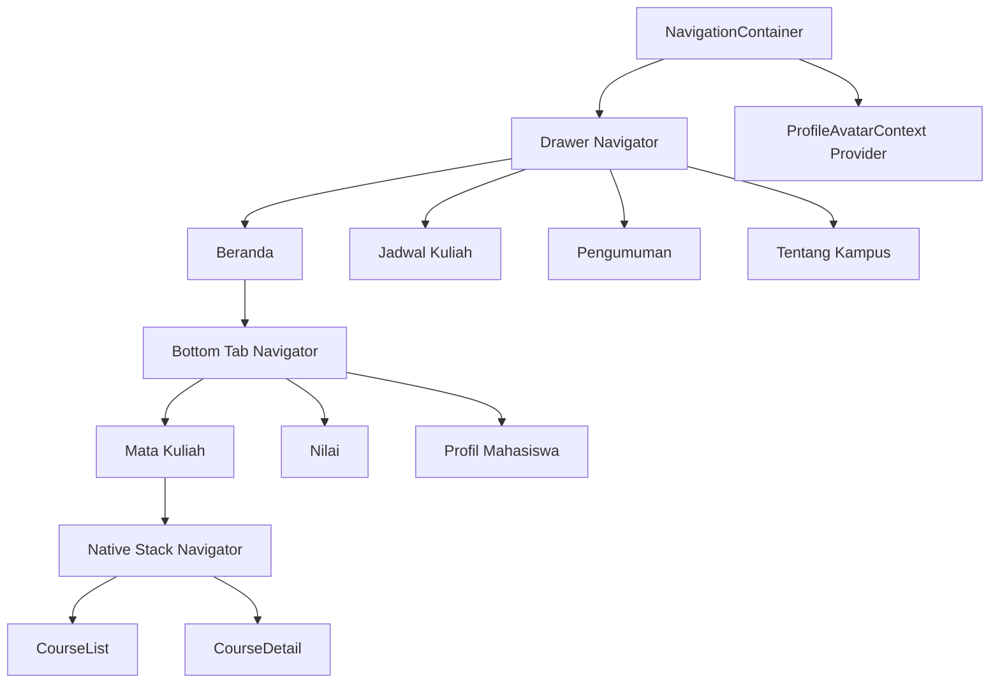

# Arsitektur Aplikasi E-Kampus Mini

## 1. Tujuan

Dokumen ini menjelaskan arsitektur navigasi, struktur layar, sumber data, state UI, dan keputusan implementasi pada aplikasi E-Kampus Mini berbasis Expo SDK 55.

## 2. Ringkasan Perubahan Arsitektur

Struktur dasar aplikasi tetap menggunakan tiga lapisan navigator, tetapi implementasinya telah diperbarui dibanding versi awal.

Perubahan utama:

- layer detail mata kuliah sekarang memakai `Native Stack Navigator`
- top bar custom dipakai lintas layar agar drawer dan back konsisten
- akses drawer dapat dilakukan dari semua layar melalui parent navigation
- avatar profil dibagikan melalui `ProfileAvatarContext`
- badge tab `Nilai` dikelola sebagai state lokal dan di-reset saat tab difokuskan
- halaman profil menambahkan alur penggantian foto melalui `expo-image-picker`

## 3. Hierarki Navigator

## 4. Lapisan Navigasi

### Layer 1: Drawer Navigator

Tanggung jawab:

- entry point utama aplikasi
- menyediakan menu global
- menampung screen yang tidak selalu berada dalam konteks tab

Screen:

- `Beranda`
- `JadwalKuliah`
- `Pengumuman`
- `TentangKampus`

Catatan implementasi:

- `drawerContent` menggunakan komponen custom `CampusDrawerContent`
- avatar dan identitas mahasiswa pada drawer mengambil data dari `ProfileAvatarContext`

### Layer 2: Bottom Tab Navigator

Tanggung jawab:

- mengelompokkan fitur inti akademik di area Beranda
- memberi akses cepat ke fitur yang paling sering dipakai

Tab:

- `MataKuliah`
- `Nilai`
- `ProfilMahasiswa`

Catatan implementasi:

- tab `Nilai` memakai `tabBarBadge`
- badge disimpan sebagai state lokal `unreadGradeCount`
- badge otomatis di-reset saat tab `Nilai` menerima fokus

### Layer 3: Native Stack Navigator

Tanggung jawab:

- menangani transisi hierarkis daftar ke detail
- menjaga pola navigasi drill-down tetap natural
- menghindari masalah asset header pada Expo 55 yang sempat muncul saat memakai stack berbasis JavaScript

Screen:

- `CourseList`
- `CourseDetail`

Catatan implementasi:

- `CourseDetailScreen` tetap memakai `navigation.setOptions()` untuk memenuhi bonus header dinamis
- native header disembunyikan karena aplikasi memakai top bar custom yang konsisten

## 5. Komponen Navigasi Pendukung

### `ScreenTopBar`

Komponen ini dipakai oleh seluruh layar utama sebagai lapisan navigasi visual yang konsisten.

Tanggung jawab:

- menampilkan judul layar dan eyebrow
- membuka drawer melalui tombol `menu` di kiri atas
- menampilkan tombol `back` di kanan atas saat layar memiliki histori kembali
- menampilkan avatar profil pada layar non-detail

Cara kerja drawer global:

- komponen menelusuri parent navigator hingga menemukan navigator yang memiliki fungsi `openDrawer`
- pendekatan ini membuat drawer dapat diakses dari screen yang berada di dalam tab maupun native stack

### `CampusDrawerContent`

Komponen custom drawer ini menggantikan drawer default agar:

- tampilan konsisten dengan referensi visual
- avatar profil yang diperbarui ikut tampil pada sidebar
- metadata mahasiswa terlihat langsung dari area navigasi global

## 6. Data dan State

### Data domain lokal

Data utama masih disimpan sebagai konstanta lokal karena fokus tugas berada pada navigasi dan komposisi layar.

#### `STUDENT`

Menyimpan identitas mahasiswa:

- nama
- NIM
- program studi
- fakultas
- semester
- email
- nomor HP
- alamat
- status
- IPK
- SKS lulus
- avatar default

#### `COURSES`

Array objek mata kuliah berisi:

- `id`
- `name`
- `code`
- `credits`
- `lecturer`
- `schedule`
- `room`
- `description`
- `icon`
- `accent`
- `grade`
- `isNew`

#### `WEEKLY_SCHEDULE`

Array dua dimensi untuk jadwal mingguan berdasarkan hari.

### State UI lokal

Selain konstanta data, aplikasi memiliki state UI berikut:

#### `avatarUri`

- disimpan pada `ProfileAvatarContext`
- dipakai oleh halaman profil, top bar, dan drawer
- berubah saat pengguna memilih foto dari galeri

#### `unreadGradeCount`

- disimpan pada `HomeTabs`
- menjadi sumber nilai badge tab `Nilai`
- di-reset saat tab `Nilai` dibuka

## 7. Pemetaan Bonus Feature

### `useNavigation()`

Lokasi:

- `QuickNavigateCard`

Alasan:

- komponen reusable ini tidak menerima prop `navigation`
- tetap perlu membuka `CourseDetail`

### `navigation.setOptions()`

Lokasi:

- `CourseDetailScreen`

Alasan:

- judul screen tetap disetel dinamis mengikuti mata kuliah aktif
- meskipun header native disembunyikan, implementasi ini tetap menunjukkan penguasaan API bonus yang diminta

### `tabBarBadge`

Lokasi:

- tab `Nilai`

Alasan:

- menunjukkan jumlah pembaruan nilai baru
- lebih bermakna daripada badge statis

## 8. Alur Pengguna

### Alur Mata Kuliah

1. Pengguna membuka `Beranda`
2. Tab default mengarah ke `MataKuliah`
3. Pengguna melihat daftar MK
4. Pengguna menekan kartu MK atau kartu akses cepat
5. Aplikasi berpindah ke `CourseDetail`
6. Top bar menampilkan tombol `back`
7. Drawer tetap dapat dibuka dari tombol `menu`

### Alur Nilai

1. Pengguna membuka tab `Nilai`
2. Badge menampilkan jumlah nilai baru sebelum tab dibuka
3. Saat tab menerima fokus, badge di-reset
4. Halaman menampilkan daftar nilai semester

### Alur Profil

1. Pengguna membuka `Profil Mahasiswa`
2. Pengguna menekan tombol kamera atau tombol `Ganti foto`
3. Aplikasi meminta izin akses galeri
4. Pengguna memilih gambar
5. `avatarUri` diperbarui
6. Avatar baru tampil serentak di profil, top bar, dan drawer

### Alur Jadwal

1. Pengguna membuka drawer dari tombol `menu`
2. Memilih `Jadwal Kuliah`
3. Aplikasi menampilkan tabel mingguan per hari dalam `ScrollView` horizontal

## 9. Keputusan Desain

Referensi visual `stitch` mengarahkan implementasi pada:

- warna primer navy
- aksen gold
- tonal surfaces
- hero section editorial
- bottom navigation membulat
- drawer profile block

Adaptasi ke React Native dilakukan melalui:

- `StyleSheet`
- `ScrollView`
- `Pressable`
- ikon `Ionicons` dan `MaterialCommunityIcons`
- top bar dan drawer custom agar pola navigasi tetap konsisten di mobile

## 10. Alasan Struktur Ini Dipertahankan

- peran setiap navigator tetap jelas
- arsitektur tetap modular meskipun semua layar masih berada dalam satu file
- perubahan kompatibilitas Expo 55 tidak mengubah struktur inti tugas
- penambahan context dan state UI tidak menambah ketergantungan global yang berlebihan

## 11. Potensi Pengembangan Lanjutan

- memecah navigator, screen, dan komponen ke folder terpisah
- menyimpan `avatarUri` ke local storage agar persist setelah aplikasi ditutup
- memindahkan data mahasiswa, nilai, dan jadwal ke API atau database lokal
- menambah auth flow dan session state
- menambahkan test untuk navigasi dan state badge
